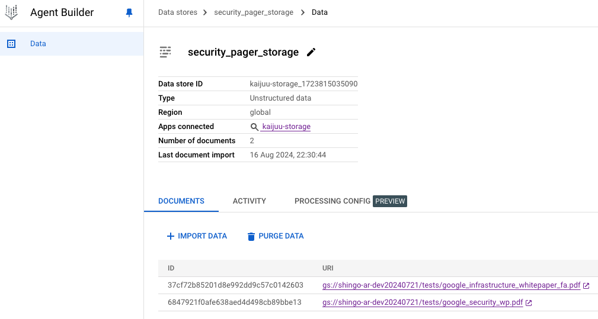

#   ChatUI using Answer API of Vertex AI Search a.k.a. Vertex AI Agent Builder
## Architecture


## Prerequisite
- Google Cloud project, billing enabled
- Google Cloud SDK(gcloud command)
- Some PDFs for search sources
- Custom domain that you have authorization
- [Option]: Python 3.10+ if testing on localhost

## Preparation
### 1. Clone this repo
On your local environment,
clone this repo and change directory.
```bash
git clone https://github.com/shin5ok/chatui-using-answerapi; cd chatui-using-answerapi/
```

### 2. Sign in your Google Cloud Project
Run as below, to get authorization.
```bash
gcloud auth login
```

If you want to test on localhost,
```bash
gcloud auth application-default login
```

### 3. Enable required services
```bash
gcloud services enable compute.googleapis.com run.googleapis.com cloudbuild.googleapis.com
```
It will take few minutes.

## Setup

### 1. Setup your Data store for Agent Builder

You can build a Data store very simply.  
Follow the link.  
[https://cloud.google.com/generative-ai-app-builder/docs/try-enterprise-search](https://cloud.google.com/generative-ai-app-builder/docs/try-enterprise-search)

> [!NOTE]
> Recommend to use Cloud Storage as data source because I have not confirmed other data sources.


### 2. Get the datastore ID

Write down the Data store ID.

The ID is "kaijuu-storage_1723815035090" in this case.

### 3. Create service accounts for Cloud Run service.

Make sure where you are in top directory, and then just type this.
```bash
make iam
```
>[!NOTE]
>In this case we just use Cloud Build default service account because just for test.  
>We recommend you prepare a custom service account for Cloud Build for production or staging to project your environment.

### 4. Deploy Cloud Run Service

Prepare environment values.
Database ID is one you wrote down before.
```bash
export PROJECT_ID=<your Project ID>
export DATASTORE_ID=<your Data store ID>
```
And then, set start up comment according to your app.
For example,
```bash
export SUBJECT="Ask me about Google Cloud security"
```

Deploy the Cloud Run service.
Specify the option as below if you want to confirm citations.
```bash
export REF_PAGES=1
```
Deploy it.
```bash
make deploy
```
Wait for few minutes until finishing the deployment.

>[!NOTE]
>You cannot access Cloud Run services yet, because the service requires Load Balancer + IAP for security reason.  
>Proceed the next step.

### 5. Configure Identity Aware Proxy(IAP) 
To prevent unauthorized access from the Internet, you can take advantage of IAP.

Follow the link.  
[https://cloud.google.com/iap/docs/enabling-cloud-run?hl=ja](https://cloud.google.com/iap/docs/enabling-cloud-run?hl=ja)  
You can use a SSL certificate provided from Managed certification or Certificate manager.

>[!NOTE]
> You need to disable CDN with the Load Balancer when adopting IAP.

### 6. Test
Open the FQDN of certificate assigned to the Load Balancer with your browser.  
Just try it.


## Option: Refresh data in Data store
When you want to refresh data to search, remember your Data store path, like gs://<Cloud Storage bucket>/data
For example,
```bash
export PROJECT_ID=<your Project ID>
export DATASTORE_ID=<your Data store ID>

poetry run python refresh_datastore.py gs://foo/data/*.pdf gs://bar/reports/*.pdf
```
